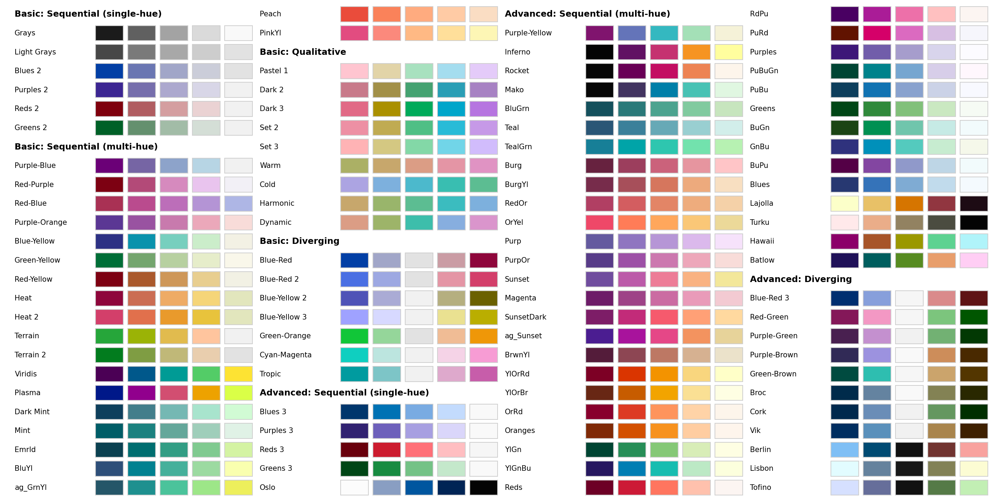
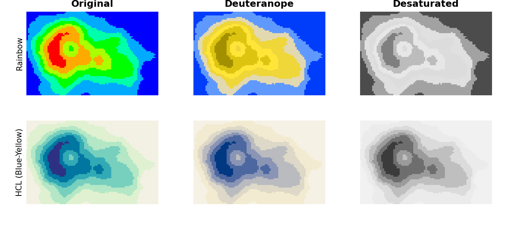

# Summary

Python _colorspace_ provides a toolbox for mapping between different color
spaces which can then be used to generate a wide range of perceptually-based
color palettes for qualitative or quantitative (sequential or diverging)
information. These palettes (as well as any other sets of colors) can be
visualized, assessed, and manipulated in various ways, e.g., by color swatches,
emulating the effects of color vision deficiencies, or depicting the perceptual
properties. Finally, the color palettes generated by the package can be easily
integrated into standard visualization in Python, e.g., using
_matplotlib_, _seaborn_, or _plotly_.


# Statement of need

Color is an integral element of visualization and graphics and is essential for
communicating (scientific) information.
However, inefficient color maps can easily break things and therefore need to
be chosen carefully
[@Tufte:1990; @Brewer:1999; @Ware:2004; @Wilkinson:2005; @Wilke:2019; @Baum:2019; @Crameri:2020].
In recent years, awareness has grown and many plotting libraries have
changed their default color palette for the better. One well-known example is
Matplotlib `2.0` which came with an update on mostly all default
colors [@matplotlib20:colors]. Most notably, 'viridis' replaces the classic
'jet' color map, a color map very similar to the infamous RGB rainbow color
palette, which is notorious for causing all sorts of problems.

One way to construct efficient color palettes with the desired characteristics is to
use a perceptual-based color model, a color model that represents the way the human
visual system processes color information [@Kaiser:1996; @Knoblauch:2002]. One such color model is the
Hue-Chroma-Luminance (HCL) model, a three-dimensional color space defined by
the following three axes:

* **Hue:** The type of color
* **Chroma:** Colorfullness
* **Luminance:** Brightness

This allows for an intuitive construction of a wide range of efficient and
well-balanced color palettes. The _colorspace_ package is not just a collection
of fixed palettes, but rather a set of building blocks to easily create new
hand-tailored perceptually-based palettes or customize existing ones by
defining trajectories (paths) trough the HCL space. These palettes can easily
be integrated in existing workflows, using plotting and graphing libraries
such as e.g., `matplotlib` [@Hunter:2007], `seaborn` [@Waskom:2021], or `plotly` [@plotly].

In addition, _colorspace_ provides a set of functions and classes for
handling, transforming, manipulating and visualizing color palettes
both from _colorspace_ but also from any other package. In particular, this
includes functionality to emulate color vision deficiencies
[@Vienot:1995; @Machado:2009] to check whether or
not a certain color palette is efficient and accessible to everyone.

**RETO: Wuerde ich irgendwo gernen nennen, weiss aber nicht wo :)**

Python _colorspace_ is the Python implementation of the well established
_R_ package [`colorspace`](https://colorspace.r-forge.r-project.org/) [@Zeileis:2020].

---

One key feature is that the package provides a variety of color palettes based
on the HCL (hue-chroma-luminance) color space, which has been shown to capture
the three perceptual dimensions of the human visual system very well. Thus,
allowing for intuitive construction of efficient color palettes using
trajectories in the three-dimensional HCL space.
Using general strategies, three main types of HCL-based palettes are
implemented: Qualitative palettes for categorical data, sequential palettes for
mapping ordered/numeric information, and diverging palettes for coding
ordered/numeric data with a central neutral value. Besides a variety of
predefined HCL palettes, users can customize them or create their own.


# Key functionality

## Chosing and constructing color palettes

A key feature of _colorspace_ is the ability to select, modify, and create effective color
maps in the HCL color space. As mentioned above, these are not fixed sets
of colors but define trajectories trough the HCL space. When drawing 'any'
number of colors from a palette, these trajectories are evaluated and (if
needed) converted to e.g., HEX colors (web colors). The package
provides three main classes of HCL-based color palettes:

* `qualitative_hcl`: Create qualitative HCL-based palettes, designed for coding
    categorical information, i.e., where no
    particular ordering of categories is available and every color should
    receive the same perceptual weight.
* `sequential_hcl`: Create sequential HCL-based palettes, designed for coding
    ordered/numeric information, i.e., going from
    high to low (or vice versa).
* `diverging_hcl`: Create diverging HCL-based palettes, designed for coding
    ordered/numeric information around a central
    neutral value, i.e., where colors diverge from neutral to two extremes.


To show the flexibility, \autoref{fig:chosingpalettes} depicts color swatches
for four HCL-based sequential palettes. The first (`pal1`)
is the predefined sequential HCL-based 'viridis' palette as is the second one
(`pal2`), but this time constructed by hand by specifying the properties of
all three trajectories.
The remaining two start with the 'viridis' settings, but adjust certain
properties. While `pal3` overwrites the chroma trajectory with a triangular one
ending in lower chroma than the original, `pal4` limits hue to the green-yellow
range.

```
from colorspace import palette, sequential_hcl, swatchplot

pal1 = sequential_hcl(palette = "viridis")
pal2 = sequential_hcl(h = [300, 75], c = [40, 95], l = [15, 90],
                      power = [1., 1.1])
pal3 = sequential_hcl(palette = "viridis", cmax = 90,  c2 = 20)
pal4 = sequential_hcl(palette = "viridis", h1 = 200)

swatchplot([palette(pal1(7), "By name"),
            palette(pal2(7), "By hand"),
            palette(pal3(7), "With triangular chroma"),
            palette(pal4(7), "With smaller hue range")],
            figsize = (8, 1.75));
```


The objects provide a series of methods to e.g., extract the settings of
the trajectories, get $n$ HEX colors or a matplotlib color map, and more.

```
pal1.settings      # Extracting settings
pal1(3)            # Extracting 3 colors
pal1.cmap()        # Get matplotlib colormap
```

Besides the HCL-based version of 'viridis', _colorspace_ comes with a wide
range of color palettes which can be used and modified if needed
(see \autoref{fig-hcl-palettes}).

```
from colorspace import hcl_palettes
hcl_palettes(plot = True, figsize = (20, 15))
```




## Assessing color maps

To demonstrate some of the functionality for palette assessment,
\autoref{fig:specplothclplot} shows a color spectrum plot (left) and
a slice through the HCL space (right) for color palette `pal4` as defined
in the previous section.

The spectrum shows the H, C, and L trajectories,
which all change monotonically from one end of the
palette to the other. The slight kink in the chroma trajectory results from
touching the outer edge of the HCL space. This can be seen in the
slice through the HCL space, where the darker half of the palette scrapes
along the outer edge of the defined space.


```
# Color spectrum (left subplot)
pal4.specplot(figsize = (5, 5));

# Palette plot in HCL space (right subplot)
pal4.hclplot(n = 7, figsize = (5, 5));
```


## Color vision deficiency

How badly inefficient color maps can break down is shown in \autoref{fig-cvd}.
The same information is plotted four times, once using an RGB rainbow based
palette and once using the sequential HCL palette
'Blue-Yellow'. While the top row shows the original colors for people
without visual constraints, the bottom row shows an emulation of how people with
deuteranomaly (colloquially known as "red-green color blindness") perceive the
same information [@Vienot:1995; @Machado:2009; @Knoblauch:2002].

This is admittedly an extreme example, but it illustrates how quickly inefficient color
maps can break down, making certain figures and results inaccessible to certain
groups of people. While many better alternatives to the RGB rainbow are readily
available, the RGB rainbow and palettes with similar problems have been used
for a long time with little caution and can still be found in use today.


```
from colorspace import demoplot, rainbow, sequential_hcl, deutan
from colorspace import diverging_hcl
import matplotlib.pyplot as plt

col1 = rainbow(end = 1/3, rev = True).colors(11)
col2 = sequential_hcl("Blue-Yellow", rev = True).colors(11)

fig, ax = plt.subplots(2, 2, figsize = (10, 5))

demoplot(col1, "Map", ax = ax[0,0], title = "(In-)famous Rainbow palette",
         ylabel = "original")
demoplot(col2, "Map", ax = ax[0,1], title = "HCL-based Blue-Yellow")
demoplot(deutan(col1), "Map", ax = ax[1,0], ylabel = "deuteranope")
demoplot(deutan(col2), "Map", ax = ax[1,1])
```




Besides `deutan` (emulate deuteranomaly) _colorspace_ allows
to emulate other color vision deficiencies. More details and examples can be found
on the [package documentation](https://retostauffer.github.io/python-colorspace/).


## Use with existing plotting libraries

Color palettes made accessible via the _colorspace_ package can easily
be deployed with existing plotting or graphics libraries. \autoref{fig-plotting}
shows two small examples using a data set shipped with the package.

The `matplotlib` figure (left) shows a 2-d histogram of daily minimum and maximum temperatures
for a weather station in Germany, the `seaborn`-based plot (right) the distribution of the
average daily temperature for the same location, split into seasons.
Whilst a 'cmap' (`.cmap()`; `LinearSegmentedColormap`) is used with `matplotlib`,
`seaborn` just requires a list of HEX colors (`.colors(4)`).
Additional examples can be found in the
[package documentation](https://retostauffer.github.io/python-colorspace/).


```
from colorspace import dataset, qualitative_hcl
import matplotlib.pyplot as plt
import seaborn as sns

df = dataset("HarzTraffic") # Loading data; requires pandas

# Demoplot using `matplotlib`
fig = plt.hist2d(df.tempmin, df.tempmax, bins = 20,
                 cmap = pal3.cmap().reversed())

plt.title("Joint density daily min/max temperature")
plt.xlabel("minimum temperature [deg C]")
plt.ylabel("maximum temperature [deg C]")
plt.show()


# Demoplot using `seaborn`
from colorspace import qualitative_hcl, dataset
import seaborn as sns 

# Color palette to be used
pal = qualitative_hcl("Dark 3", h1 = -180, h2 = 100)

g = sns.displot(data = df, x = "tempmax", hue = "season", fill = "season",   
                kind = "kde", rug = True, height = 4, aspect = 1,
                palette = pal.colors(4))
g.set_axis_labels("temperature [deg C]")              
g.set(title = "Distribution of daily maximum temperature given season")
plt.tight_layout()
plt.show()
```


# Dependencies and availability

With a light-weight design in mind, most core functionality only requires `numpy`.
For full functionality, `matplotlib`, `imageio` [@imageio] and
`pandas` [@pandas] will need to be installed.

_colorspace_ is available via [PyPI](https://pypi.org/project/colorspace).
[source code](https://github.com/retostauffer/python-colorspace) and
[package documentation](https://retostauffer.github.io/python-colorspace/) are
hosted on github, where bug reports, software contributions and feature requests
are always welcome.


# Acknowledgements

**RETO: Brauchen wir sowas? Haette sonst hier noch der alten R-colorspace-Gang
gedankt, aber Platz ist eigentlich eh keiner.**


# References


